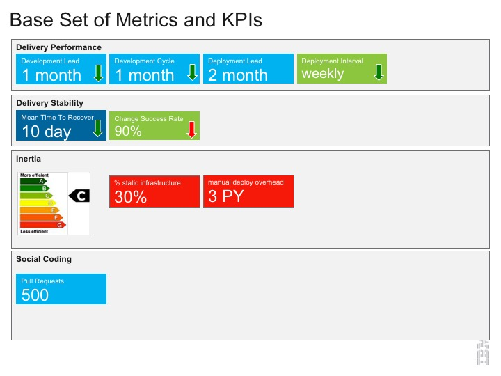

# agile-metrics-dashboard 
Dashing based metrics server

Example:

The project presents product team metrics using dashing

Metric values are retrieved from a couchdb database

To run the server the first time, make sure you have the latest [Docker toolbox] (https://www.docker.com/products/docker-toolbox), 
use the Docker Quickstart Shell and then run from the top-level directory of this clone:

./dashboard up

This will pull in and build the container images and run two containers:
db
web

Visit http://192.168.99.100:3030 (which is the docker VM containers address on your machine) to see the results

Template documents are added to couchdb to be expanded upon by the server admin

Data is stored in various couchdb documents in a 'metrics' database.  There is a two tier structure that is intended to allow product teams to run their own server (with modified metrics) and feed into a central cross team version

Template documents are held in  doc-templates
